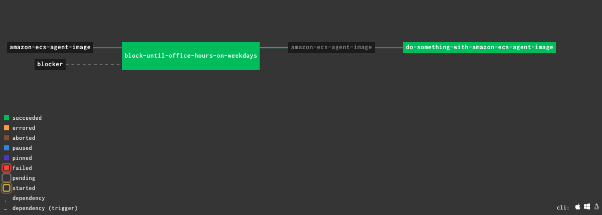

# Blocker

The blocker application is designed to block a trigger from any resources from going to a job until the right time. This will ensure that the job can start at the appropriate time. For example, the following YAML file for Concourse has the job `block-until-office-hours-on-weekdays` which has specified days, timezone, start time and end time. This jobs blocks the trigger from the resource `amazon-ecs-agent-image`, which checks for latest version of Amazon ECS Agent docker image every 24 hours, until office hours on weekdays.

```buildoutcfg
---
resources:
  - name: amazon-ecs-agent-image
    type: docker-image
    check_every: 24h
    source:
      repository: amazon/amazon-ecs-agent
      tag: latest

  - name: blocker
    type: git
    check_every: 24h
    source:
      private_key: ((private_key))
      uri: git@github.com:adityapahuja/blocker.git
      branch: master

jobs:
  - name: block-until-office-hours-on-weekdays
    serial: true
    build_log_retention:
      builds: 1
      minimum_succeeded_builds: 1
    plan:
      - get: blocker
      - get: amazon-ecs-agent-image
        trigger: true
      - task: block-until-office-hours
        timeout: 72h
        params:
          DAYS: 'MONDAY,TUESDAY,WEDNESDAY,THURSDAY,FRIDAY'
          START_TIME: '08:00:00'
          STOP_TIME: '16:30:00'
          TIMEZONE: 'Europe/London'
        config:
          inputs:
            - name: blocker
          platform: linux
          image_resource:
            type: docker-image
            source:
              repository: python
              tag: 3.8.2-alpine3.11
          run:
            path: sh
            dir: blocker
            args:
              - -c
              - |
                set -ue
                pip install --upgrade pip
                pip install --no-cache-dir -r requirements.txt
                python blocker.py -d $DAYS -t $TIMEZONE -s $START_TIME -e $STOP_TIME

  - name: do-something-with-amazon-ecs-agent-image
    serial: true
    build_log_retention:
      builds: 1
      minimum_succeeded_builds: 1
    plan:
      - get: amazon-ecs-agent-image
        trigger: true
        passed: [block-until-office-hours-on-weekdays]
      - task: do-something
        timeout: 10m
        config:
          inputs:
            - name: amazon-ecs-agent-image
          platform: linux
          image_resource:
            type: docker-image
            source:
              repository: alpine
              tag: 3.11.6
          run:
            path: sh
            args:
              - -c
              - |
                set -ue
                echo "Did something"
```

Pipeline in Concourse


